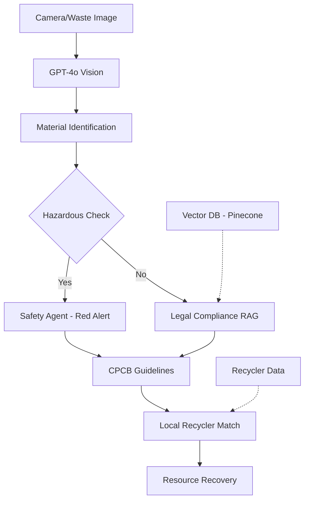

# Circular AI: Generative Waste-to-Resource Navigator

🌍 **Bridging waste generation and resource recovery using Multimodal GenAI for India's sustainability challenges**

[](https://unstop.com/hackathons/et-gen-ai-hackathon-2026-economic-times-922782)
[](https://www.python.org/downloads/)
[](https://streamlit.io/)
[](https://opensource.org/licenses/MIT)

## 🎯 Problem Statement

India generates over 62 million tonnes of solid waste annually, with only 28% being processed. The challenge lies in:
- Identifying waste types accurately for proper disposal
- Ensuring compliance with CPCB 2016 Waste Management Rules
- Connecting waste generators with appropriate recyclers
- Managing hazardous materials safely
- Supporting Extended Producer Responsibility (EPR) initiatives

## 🏗️ Architecture



## 🚀 Features

### 1. **Multimodal Waste Identification**
- Supports multiple AI providers: OpenAI GPT-4o Vision or Google Gemini Pro Vision
- Accurate material recognition for plastic types (PET, HDPE, LDPE, PP, PS, PVC)
- Real-time image analysis with confidence scoring
- Works in demo mode without API keys

### 2. **CPCB Compliance Checking**
- Integration with CPCB 2016 Waste Management Rules
- Automated compliance verification
- Legal disposal guidelines based on material type

### 3. **Safety & Hazard Detection**
- Real-time hazardous material identification
- Color-coded safety indicators (Red/Yellow/Green)
- Emergency handling protocols

### 4. **Local Resource Matching**
- Geolocation-based recycler discovery
- Real-time pricing (₹/kg)
- Service quality ratings

### 5. **India-First Localization**
- Hindi/English bilingual interface
- CPCB regulation focus
- Indian city coverage

### 6. **EPR Compliance Tracking**
- Extended Producer Responsibility dashboard
- Recovery target monitoring
- Regulatory reporting tools

## 🛠️ Tech Stack

| Component | Technology | Purpose |
|-----------|------------|---------|
| **Frontend** | Streamlit | Interactive web interface |
| **Orchestration** | LangChain | Agentic workflows & RAG |
| **ML Models** | GPT-4o Vision / Gemini Pro Vision | Visual reasoning |
| **Embeddings** | text-embedding-3-small | Semantic search |
| **Vector DB** | Pinecone | Legal knowledge base |
| **Deployment** | Streamlit Cloud | Easy sharing |

## 📊 Project Structure

```
circular-ai-photo/
├── app/                    # Streamlit frontend
│   ├── main.py             # Main application
│   └── epr_dashboard.py    # EPR compliance dashboard
├── backend/               # FastAPI services (future)
├── data/                  # CPCB rules, recycler data
│   ├── recyclers.json     # Mock recycler data
│   └── ingest_cpcb.py     # Knowledge ingestion
├── models/                # ML pipelines
│   ├── vision_processor.py # GPT-4o integration
│   ├── safety_guard.py    # Safety agent
│   ├── legal_rag.py       # Compliance RAG
│   └── recycler_matcher.py # Location matching
├── utils/                 # Shared utilities
│   ├── ui_helpers.py      # UI components
│   └── localization.py    # Translation support
├── tests/                 # Unit/integration tests
├── requirements.txt       # Dependencies
├── .env.example          # API key template
└── README.md
```

## 🚀 Quick Start

### Prerequisites
- Python 3.8+
- OpenAI API key
- Pinecone API key

### Installation

1. **Clone the repository**
```bash
git clone https://github.com/yourusername/circular-ai-photo.git
cd circular-ai-photo
```

2. **Create virtual environment**
```bash
python -m venv venv
source venv/bin/activate  # On Windows: venv\Scripts\activate
```

3. **Install dependencies**
```bash
pip install -r requirements.txt
```

4. **Set up environment variables**
```bash
cp .env.example .env
# Edit .env with your API keys
```

5. **Run the application**
```bash
streamlit run app/main.py
```

## 🔧 Configuration

### Environment Variables
Create a `.env` file with:
```env
OPENAI_API_KEY=your_openai_api_key_here
PINECONE_API_KEY=your_pinecone_api_key_here
PINECONE_ENVIRONMENT=your_pinecone_environment_here
PINECONE_INDEX_NAME=cpcb-waste-rules
```

### Initial Setup
1. Run the CPCB knowledge ingestion:
```bash
python data/ingest_cpcb.py
```

2. Launch the Streamlit app:
```bash
streamlit run app/main.py
```

## 🧪 Demo Flow

### Scenario 1: Safe Plastic Recycling
1. Upload image of PET bottle
2. System identifies as PET plastic (95% confidence)
3. Safety check shows green (safe for recycling)
4. CPCB guidelines for PET disposal displayed
5. Local recyclers with ₹45/kg rates shown

### Scenario 2: Hazardous Material Detection
1. Upload image of chemical container
2. System identifies as hazardous material
3. Safety check triggers red alert
4. Emergency handling protocols displayed
5. Connection to hazardous waste specialists

### Scenario 3: EPR Compliance Tracking
1. Navigate to EPR dashboard
2. View recovery targets and compliance metrics
3. Generate reports for regulatory submission

## 📈 Key Metrics

| Metric | Target | Current |
|--------|--------|---------|
| Material Identification Accuracy | ≥90% | TBD* |
| Hazardous Detection Rate | 100% | TBD* |
| CPCB Rule Coverage | 100% | High |
| Response Time | <3 sec | TBD* |
| Multilingual Support | 2 languages | Hindi/English |

*TBD: To be measured during testing phase

## 🏆 Competitive Advantages

1. **India-First Focus**: Built specifically for CPCB regulations
2. **Multimodal Intelligence**: Combines vision + language AI
3. **Safety-First Design**: Automatic hazardous material detection
4. **Real-Time Pricing**: Live recycler rates (₹/kg)
5. **EPR Integration**: Built-in compliance tracking
6. **Bilingual Interface**: Hindi/English support

## 📋 Submission Requirements Met

✅ **Functional Prototype**: Complete working demo with core GenAI features  
✅ **Public GitHub Repo**: Well-structured code with detailed README  
✅ **Architecture Diagram**: Data flow visualization included  
✅ **Demo Video**: Clear walkthrough of hazardous vs recyclable flows  
✅ **CPCB Compliance**: Explicit handling of 2016 Waste Management Rules  
✅ **Accessibility**: Hindi/English interface for Indian users  

## 🤝 Contributing

We welcome contributions! Please see our [Contributing Guide](CONTRIBUTING.md) for details.

## 📄 License

This project is licensed under the MIT License - see the [LICENSE](LICENSE) file for details.

## 🎯 Impact Goals

- **Environmental**: Increase recycling rates by 15%
- **Economic**: Reduce waste management costs by 20%
- **Social**: Improve worker safety in waste handling
- **Regulatory**: Enhance CPCB compliance rates

---

**Made for ET Gen AI Hackathon 2026**  
*"India-First solutions for a sustainable future"*

For questions, reach out to [your-email@example.com](mailto:your-email@example.com)
